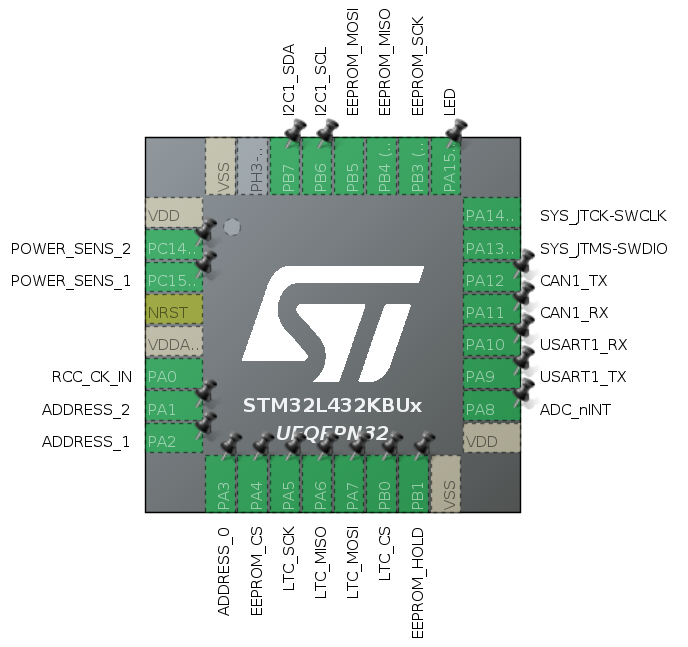

# Cellboard

The battery pack is divided in **6 segments** with **18 cells** each for a total of **108 cells**.

A **cellboard** is the unit that manage a single segment of the pack, doing all the needed measurements and the balancing.

Each cellboard is **independent** from the others, but they all share the same code, which mainly contains the following parts:
- [Measurements](measures.md)
  - [Voltages](volt.md)
  - [Temperatures](temp.md)
- [Balancing](bal.md)
- [CAN communication](can_comm.md)