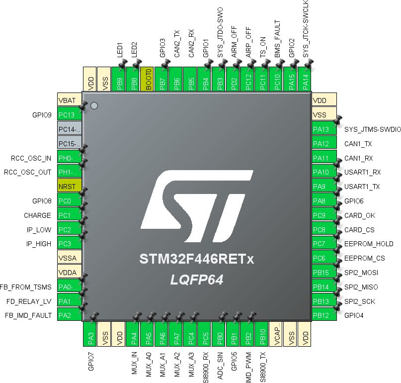

# I/O

There are many peripherals and devices connected to the mainboard.

Every component that interfaces with the mainboard's microcontroller is listed here:

- **CAN-buses** (CAN):\
    a CAN-bus to communicate with the car and an internal isolated bus for handling the cellboards.
- **adc124021 ADC** (SPI):\
    used to measure pack's and bus' voltages, also used to measure the pack's current using a shunt resistor.
- **DAHB S/160 Hall-effect sensor** (ADC):\
    used to measure pack's current. It's less precise than the shunt, included for historical reasons. The unit contains two sensors with different gains to have a broader current range.
- **AIR and pre-charge controls**:\
    three output pins control the actuation of the AIRs *(if the shutdown circuit is not latched in the off state)* and the pre-charge circuit.
- **Circuit feedbacks** (MUX/ADC):\
    16 multiplexed analog signals coming from the mainboard's circuit. It's used to diagnose the circuit and to verify its correct state compared to the BMS state. Some of those feedbacks are not multiplexed to let them generate of interrupts.
- **IMD Status** (PWM):\
    the IMD has an output PWM signal that reports its internal state.
- **M95256 EEPROM** (SPI):\
    used to store runtime variables and data, such as State-of-Charge information, balancing threshold and more.
- **SD-card** (SPI):\
    an SD-card has been included on the mainboard, in order to use it as storage for extended logs.
- **User console** (UART):\
    a serial interface has been reserved as an user interface to read/write data and execute commands. The [cli](https://github.com/eagletrt/micro-libs/tree/master/cli) library is used as an interface.
- **GPIOs**:\
    9 GPIO pins for external stuff.

