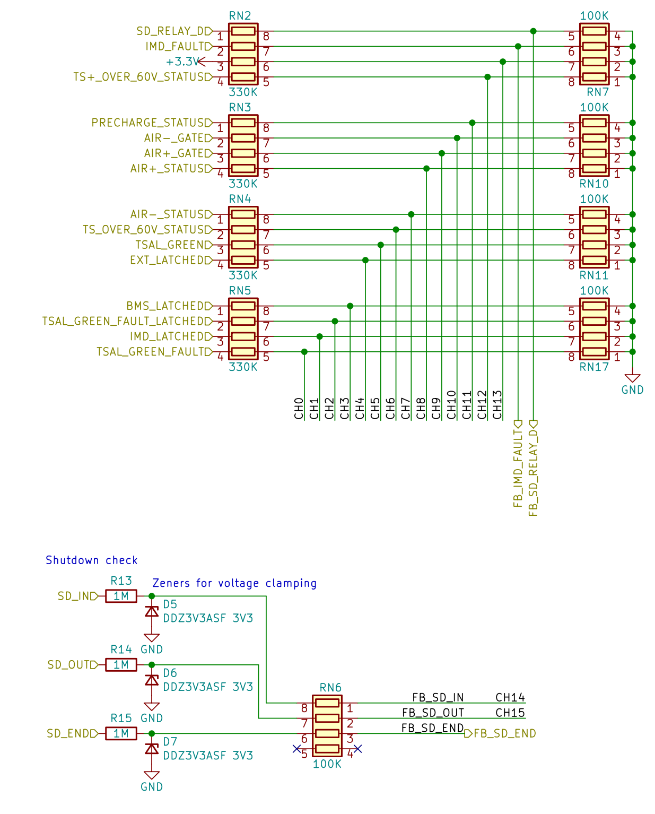

# Feedback
Feedback system is a self check of the car state, used in the [bms_fsm](subsystems/bms_fsm).  
It consists of 19 signals by which is possible to verify the correct behaviour of the fsm and react to changes on the shutdown.
16 of them are multiplexed and 3 are not, in order to react quicker to them.

All theese signals are read with an internal ADC (adc1) in order to better interprete their logic state (actually if <2.5V is low, >9.5 is high and everything in between is unsafe)